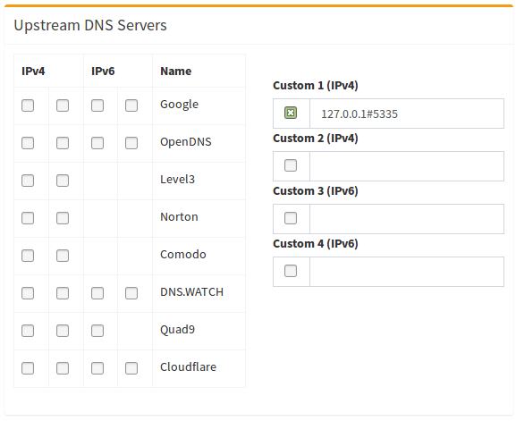

# Pi Hole on Proxmox

```bash
apt update && upgrade -y
apt install curl htop -y
curl -sSL https://install.pi-hole.net | bash
```

- Change password: `pihole -a -p`
- Change to fahrenheit: `pihole -a -f`

## Unbound

```
client <-[53]-> pihole <-[5335]-> unbound <---> authoritative_DNS_source
```

```bash
sudo apt install unbound
```

Create `/etc/unbound/unbound.conf.d/pi-hole.conf`

```conf
server:
    # If no logfile is specified, syslog is used
    # logfile: "/var/log/unbound/unbound.log"
    verbosity: 0

    interface: 127.0.0.1
    port: 5335
    do-ip4: yes
    do-udp: yes
    do-tcp: yes

    # May be set to yes if you have IPv6 connectivity
    do-ip6: no

    # You want to leave this to no unless you have *native* IPv6. With 6to4 and
    # Terredo tunnels your web browser should favor IPv4 for the same reasons
    prefer-ip6: no

    # Use this only when you downloaded the list of primary root servers!
    # If you use the default dns-root-data package, unbound will find it automatically
    #root-hints: "/var/lib/unbound/root.hints"

    # Trust glue only if it is within the server's authority
    harden-glue: yes

    # Require DNSSEC data for trust-anchored zones, if such data is absent, the zone becomes BOGUS
    harden-dnssec-stripped: yes

    # Don't use Capitalization randomization as it known to cause DNSSEC issues sometimes
    # see https://discourse.pi-hole.net/t/unbound-stubby-or-dnscrypt-proxy/9378 for further details
    use-caps-for-id: no

    # Reduce EDNS reassembly buffer size.
    # IP fragmentation is unreliable on the Internet today, and can cause
    # transmission failures when large DNS messages are sent via UDP. Even
    # when fragmentation does work, it may not be secure; it is theoretically
    # possible to spoof parts of a fragmented DNS message, without easy
    # detection at the receiving end. Recently, there was an excellent study
    # >>> Defragmenting DNS - Determining the optimal maximum UDP response size for DNS <<<
    # by Axel Koolhaas, and Tjeerd Slokker (https://indico.dns-oarc.net/event/36/contributions/776/)
    # in collaboration with NLnet Labs explored DNS using real world data from the
    # the RIPE Atlas probes and the researchers suggested different values for
    # IPv4 and IPv6 and in different scenarios. They advise that servers should
    # be configured to limit DNS messages sent over UDP to a size that will not
    # trigger fragmentation on typical network links. DNS servers can switch
    # from UDP to TCP when a DNS response is too big to fit in this limited
    # buffer size. This value has also been suggested in DNS Flag Day 2020.
    edns-buffer-size: 1232

    # Perform prefetching of close to expired message cache entries
    # This only applies to domains that have been frequently queried
    prefetch: yes

    # One thread should be sufficient, can be increased on beefy machines. In reality for most users running on small networks or on a single machine, it should be unnecessary to seek performance enhancement by increasing num-threads above 1.
    num-threads: 1

    # Ensure kernel buffer is large enough to not lose messages in traffic spikes
    so-rcvbuf: 1m

    # Ensure privacy of local IP ranges
    private-address: 192.168.0.0/16
    private-address: 169.254.0.0/16
    private-address: 172.16.0.0/12
    private-address: 10.0.0.0/8
    private-address: fd00::/8
    private-address: fe80::/10
```

Add to `/etc/dnsmasq.d/99-edns.conf`:

```
edns-packet-max=1232
```

```bash
sudo service unbound restart

# test it works
dig pi-hole.net @127.0.0.1 -p 5335         # success
dig fail01.dnssec.works @127.0.0.1 -p 5335 # FAIL
dig dnssec.works @127.0.0.1 -p 5335        # success
```

Specify `127.0.0.1#5335` as the Custom DNS (IPv4) in DNS settings:



Disable resolvconf.conf entry for unbound (Required for Debian Bullseye+ releases):

```bash
systemctl is-active unbound-resolvconf.service # if inactive goood
sudo systemctl disable --now unbound-resolvconf.service # else do this

# these may not exist
sudo sed -Ei 's/^unbound_conf=/#unbound_conf=/' /etc/resolvconf.conf
sudo rm /etc/unbound/unbound.conf.d/resolvconf_resolvers.conf

sudo service unbound restart
```

## Black and White Lists

```
pihole -w mparticle.weather.com
pihole --regex [0-9a-zA-Z\-\.]+tiktok[0-9a-zA-Z\-\.]+
pihole --regex (\.|^)litix\.io$
```
## AdLists

```
https://raw.githubusercontent.com/StevenBlack/hosts/master/hosts
https://raw.githubusercontent.com/walchko/judoon/master/hosts.txt
https://v.firebog.net/hosts/AdguardDNS.txt
https://v.firebog.net/hosts/Prigent-Adult.txt
https://v.firebog.net/hosts/RPiList-Phishing.txt
https://v.firebog.net/hosts/RPiList-Malware.txt
https://v.firebog.net/hosts/Easyprivacy.txt
https://v.firebog.net/hosts/Prigent-Ads.txt
https://v.firebog.net/hosts/Admiral.txt
https://v.firebog.net/hosts/static/w3kbl.txt
```


## Unattended Install - Not Sure This Works

https://discourse.pi-hole.net/t/pi-hole-as-part-of-a-post-installation-script/3523/4

```bash
curl -L https://install.pi-hole.net | bash /dev/stdin --unattended
```

create `/etc/pihole/setupVars.conf`

```bash
echo -n P@ssw0rd | sha256sum | awk '{printf "%s",$1 }' | sha256sum
```
```
WEBPASSWORD=<some_double_sha256_hash>
PIHOLE_INTERFACE=eth0
IPV4_ADDRESS=192.168.x.y/24
IPV6_ADDRESS=fd00::2
QUERY_LOGGING=true
INSTALL_WEB_INTERFACE=true
LIGHTTPD_ENABLED=false
INSTALL_WEB_SERVER=false
DNSMASQ_LISTENING=single
PIHOLE_DNS_1=8.8.8.8
PIHOLE_DNS_2=8.8.4.4
PIHOLE_DNS_3=2001:4860:4860:0:0:0:0:8888
PIHOLE_DNS_4=2001:4860:4860:0:0:0:0:8844
DNS_FQDN_REQUIRED=true
DNS_BOGUS_PRIV=true
DNSSEC=false
TEMPERATUREUNIT=C
WEBUIBOXEDLAYOUT=traditional
API_EXCLUDE_DOMAINS=
API_EXCLUDE_CLIENTS=
API_QUERY_LOG_SHOW=all
API_PRIVACY_MODE=false
BLOCKING_ENABLED=true
REV_SERVER=true
REV_SERVER_CIDR=192.168.x.0/24
REV_SERVER_TARGET=192.168.x.z
REV_SERVER_DOMAIN=my.local.domain
CACHE_SIZE=10000
```

# Reference

- [ansible pihole](https://codeberg.org/ansible/pihole)
- [Recursive DNS with Unbound](https://docs.pi-hole.net/guides/dns/unbound/)
- [PiHole on Proxmox](https://www.naturalborncoder.com/linux/2023/07/12/installing-pi-hole-on-proxmox/)